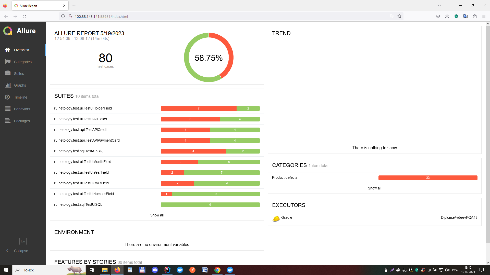
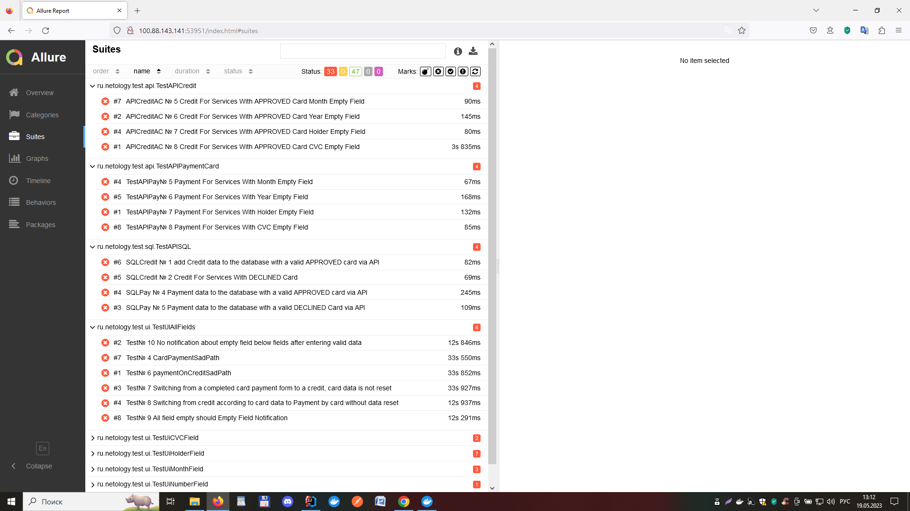
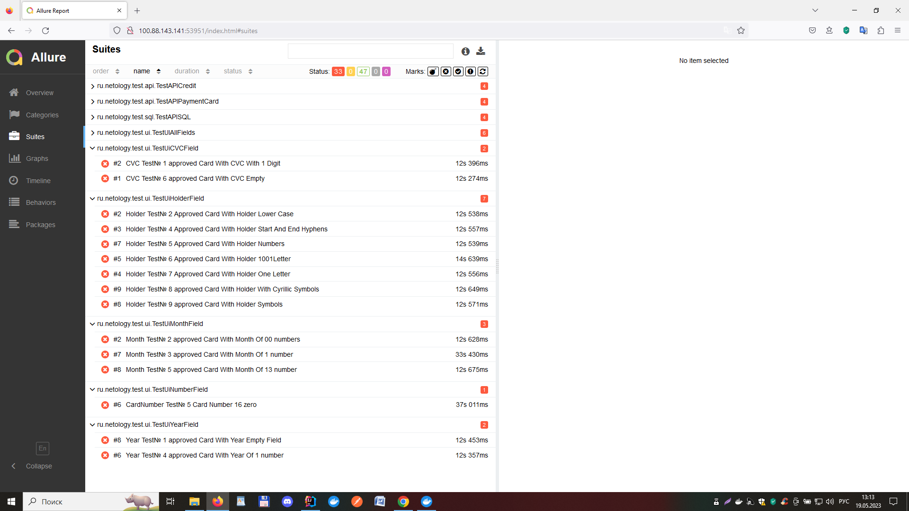

# Отчёт по итогам тестирования

Отчёт по результату автоматизированного тестированию функционала покупки и оформления кредита по данным карты веб-сервиса покупки тура  
"Путешествие дня".

## Количество тест-кейсов

Всего было проведено 80 авто-тестов. Общий процент успешных тестов равен 58,75%.

Результаты прогона тестов не зависят от типа подключенной БД.

### Общие итоги:

|                  | Кол-во тестов | Passed | Failed | Passed, % |
|:-----------------|:-------------:|:------:|:------:|----------:|
| API тестирование |      16       |   8    |   8    |       50% |
| SQL тестирование |      12       |   8    |   4    |    66,66% |
| UI тестирование  |      52       |   31   |   21   |    59,61% |
| Всего            |      80       |   47   |   33   |    58.75% |

В результате прогона тестов, по найденным багам, было составлено 34 issues и несколько предложений по улучшению [issue](https://github.com/avdeevaleksandr817/DiplomaAvdeevFQA43/issues). 

# Отчётные документы по итогам тестирования

## Краткое описание
Реализована автоматизация тестирования комплексного сервиса для покупки тура в "Путешествие дня"

## Количество тест-кейсов
Общее количество тест-кейсов для каждой СУБД - 80 шт

## Процент успешных и не успешных тест-кейсов
в БД *MySQL:*

в БД *PostgreSQL:*

